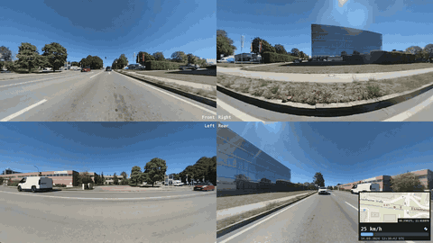
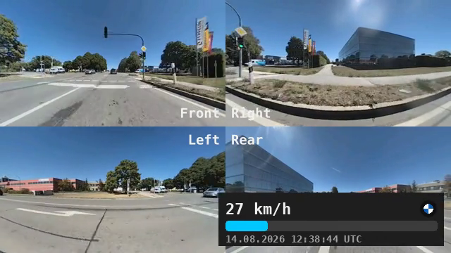
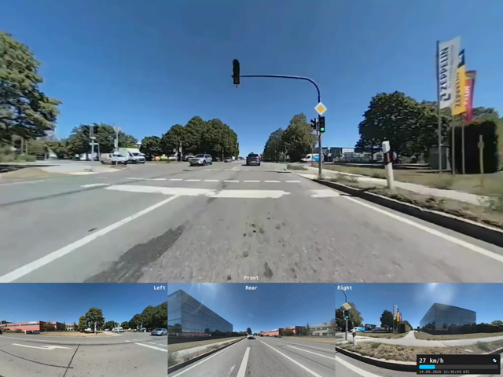

# BMW Drive Recorder Composer

[BMW Drive Recorder](https://www.bmw.de/de/shop/ls/dp/Base_Drive_Recorder_de) uses the car's ADAS cameras (front, rear, and both sides) to record its surroundings (up to 60s per recording). A USB export creates four separate per-camera videos plus an accompanying XML telemetry file (vehicle speed and GPS position). **This CLI tool stitches that data dump into a single video with a synchronized map and speed information overlay**.



> [!WARNING]
> Tested on **iDrive 8.5** with German exports - other iDrive versions and languages are untested. **This project is not affiliated or associated with BMW.** It is for personal use on Drive Recorder exports you already own.

## Expected Data Format

USB exports from **iDrive 8.5** clips up to 60 s. Other OS versions and languages are currently untested. Filenames use German camera names, while raw `*_Rohdaten.mp4` videos are ignored. ``The XML stem must match the camera prefixes:

```yaml
yyyy-mm-dd_hh-mm-ss_<trigger>/
  yyyy-mm-dd_hh-mm-ss_<trigger>.xml
  …_Kamera_Vorn.mp4        # front
  …_Kamera_Hinten.mp4      # rear
  …_Kamera_Links.mp4       # left
  …_Kamera_Rechts.mp4      # right
```

Telemetry is in the XML (`<ENTRY>` about every 15 frames at **30 fps**; `ID` is 1-based, `frame = ID - 1`):


| Field                   | HUD                                           |
| ----------------------- | --------------------------------------------- |
| `DATE_UTC`, `TIME_UTC`  | Timestamp, shown as UTC (no local conversion) |
| `VELOCITY_KMH`          | Speed bar                                     |
| `LATITUDE`, `LONGITUDE` | Map; `(0, 0)` means no GPS                    |


> [!TIP]
> `tests/fixtures/sample/` is a real 5 s clip (dummy VIN, original GPS/speed). 

## Usage (Docker)

Docker is the intended way to use this tool:

```bash
# Inspect the data
docker compose run --build --rm bmw-compose tests/fixtures/sample --inspect

# Export video
docker compose run --build --rm bmw-compose tests/fixtures/sample -o out.mp4 --no-map
```

For `h264_nvenc`, pass `--gpus all` on `run` if the NVIDIA container toolkit can be used.

### Options

Omitted flags use the defaults below. On a TTY, the wizard lets you pick with arrow keys.

| 2×2 grid              | Hero (front on top)         |
| --------------------- | --------------------------- |
|  |  |
Map tiles © [OpenStreetMap](https://www.openstreetmap.org/copyright).

| Flag                | Default                 | Description                                                           |
| ------------------- | ----------------------- | --------------------------------------------------------------------- |
| `--inspect`         | off                     | Print the summary table and exit                                      |
| `--show-vin`        | off                     | Include VIN in the inspect table                                      |
| `--dry-run`         | off                     | Print the mosaic filter graph and exit                                |
| `--layout`          | `grid2x2`               | `grid2x2` or `hero-bottom`                                            |
| `--hero`            | `front`                 | Hero camera: `front`, `left`, `right`, `rear`                         |
| `--source`          | `processed`             | `processed` (use this). `raw` exists in some exports; unused here     |
| `-o` / `--output`   | `<folder>_composed.mp4` | Output path                                                           |
| `--crf`             | `23`                    | Quality (lower = better; NVENC uses `-cq`)                            |
| `--preset`          | `medium`                | Encoder preset                                                        |
| `--codec`           | `libx264`               | `libx264`, `libx265`, `h264_nvenc`, `hevc_nvenc`, `h264_videotoolbox` |
| `--width`           | `1920`                  | Output canvas width                                                   |
| `--map-position`    | `bottom-right`          | Instrument card corner                                                |
| `--map-size`        | `320x240`               | Map size inside the card                                              |
| `--map-mode`        | `follow`                | `follow` or `overview`                                                |
| `--no-map`          | off                     | Speed/metadata strip only                                             |
| `--speed-unit`      | `kmh`                   | `kmh` or `mph`                                                        |
| `--flip-rear`       | off                     | Horizontally flip rear camera                                         |
| `--version`         | off                     | Print version and exit                                                |
| `--start` / `--end` | off                     | Trim in seconds                                                       |
| `--all`             | off                     | Compose every recording subfolder                                     |
| `--theme`           | off                     | YAML HUD theme (colors, font)                                         |

## Theme

`--theme` is a YAML file for HUD colors and font. Unset keys keep defaults.

```yaml
accent: [0, 200, 255]
card_bg: [30, 30, 30]
speed_scale_kmh: 250
speed_scale_mph: 160
```

### Examples

```bash
docker compose run --build --rm bmw-compose tests/fixtures/sample --layout hero-bottom --hero front --no-map
docker compose run --build --rm bmw-compose tests/fixtures/sample --dry-run
docker compose run --build --rm --gpus all bmw-compose path/to/export --codec h264_nvenc --preset p4
docker compose run --build --rm bmw-compose tests/fixtures/sample --theme tests/fixtures/theme.yaml --no-map
```

## Host install (optional)

```bash
# Ubuntu/Debian
sudo apt install ffmpeg fonts-dejavu-core

# macOS
brew install ffmpeg

pip install -e .
bmw-compose tests/fixtures/sample -o out.mp4 --no-map
```

## License

MIT.